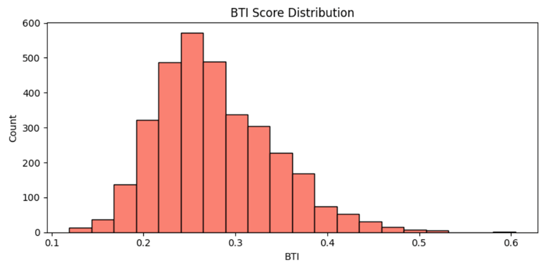

# Trustworthy RAG for Biomedical Question Answering

This project focuses on building a Retrieval-Augmented Generation (RAG) system for biomedical question answering, with a strong emphasis on reliability and trust. In domains like healthcare, generating answers is not enough — the answers must be accurate, grounded in evidence, and trustworthy. This work is an attempt to move beyond basic RAG implementations and introduce a system that not only retrieves and generates responses but also evaluates how reliable those responses are.

The system combines both dense and sparse retrieval techniques to improve the quality of information retrieval. FAISS is used for dense semantic search, while BM25 is used for keyword-based retrieval. The results from both approaches are then combined using Reciprocal Rank Fusion (RRF), which helps in selecting the most relevant and meaningful information from the dataset. To further improve retrieval, the system also applies simple domain-aware query expansion so that biomedical terms can be matched more effectively.

Once the relevant information is retrieved, the system generates answers by combining the top results. Instead of relying purely on generation, the output is grounded in the retrieved context, which helps reduce hallucination and improves factual consistency. In addition to generating answers, the system evaluates each response using a custom trust metric called the Biomedical Trust Index (BTI). This metric takes into account factors such as attribution, confidence, and exact match, giving a more complete view of how reliable a generated answer is.

The entire pipeline is implemented in a modular way to keep the code clean and easy to understand. Different components such as data loading, embedding generation, retrieval, and evaluation are separated into individual modules. A smaller sample of the MedQuAD dataset is used so that the project remains lightweight and easy to run, while still demonstrating the complete workflow of a trust-aware RAG system.

To run the project, install the required dependencies using “pip install -r requirements.txt” and execute “python src/main.py”. The system processes the dataset, retrieves relevant information, generates answers, and outputs evaluation metrics along with visualizations.

The results of the project include multiple evaluation graphs such as BTI score distribution and confidence versus attribution analysis, which help in understanding the behavior and reliability of the system. These results highlight how combining retrieval strategies and trust evaluation can improve the overall performance of RAG systems, especially in sensitive domains.

Overall, this project demonstrates how RAG systems can be extended beyond simple retrieval and generation to include trust, evaluation, and interpretability. This makes them more suitable for real-world applications where reliability is critical. In the future, this system can be further improved by integrating large language models, enhancing attribution mechanisms, and building an interactive interface for better usability.

## Results

Below are some sample evaluation results from the system:

### BTI Score Distribution

### Confidence vs Attribution

